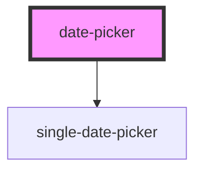

# date-picker

<!-- Auto Generated Below -->

## Properties

| Property        | Attribute       | Description | Type                  | Default     |
| --------------- | --------------- | ----------- | --------------------- | ----------- |
| `defaultStyle`  | `default-style` |             | `string`              | `undefined` |
| `defaultValue`  | `default-value` | YYYY-MM-DD  | `Date \| string`      | `undefined` |
| `displayFormat` | --              |             | `(d: Date) => string` | `undefined` |
| `maxDate`       | --              |             | `Date`                | `undefined` |
| `minDate`       | --              |             | `Date`                | `undefined` |
| `target`        | `target`        |             | `string`              | `undefined` |

## Dependencies

### Depends on

- [single-date-picker](../datePickerParts/single-date-picker)

### Graph

----------------------------------------------

*Built with [StencilJS](https://stenciljs.com/)*
