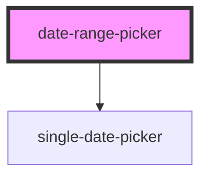

# date-range-picker

<!-- Auto Generated Below -->

## Properties

| Property          | Attribute          | Description | Type                                  | Default     |
| ----------------- | ------------------ | ----------- | ------------------------------------- | ----------- |
| `defaultStyle`    | `default-style`    |             | `string`                              | `undefined` |
| `defaultValue`    | --                 |             | `{ startDate: Date; endDate: Date; }` | `undefined` |
| `displayFormat`   | --                 |             | `(d: Date) => string`                 | `undefined` |
| `maxDate`         | --                 |             | `Date`                                | `undefined` |
| `minDate`         | --                 |             | `Date`                                | `undefined` |
| `placeholder`     | `placeholder`      |             | `string`                              | `undefined` |
| `separator`       | `separator`        |             | `string`                              | `undefined` |
| `shortcutList`    | `shortcut-list`    |             | `ShortcutType[] \| boolean`           | `undefined` |
| `target`          | `target`           |             | `string`                              | `undefined` |
| `useConfirmation` | `use-confirmation` |             | `boolean`                             | `false`     |

## Dependencies

### Depends on

- [single-date-picker](../datePickerParts/single-date-picker)

### Graph

----------------------------------------------

*Built with [StencilJS](https://stenciljs.com/)*
