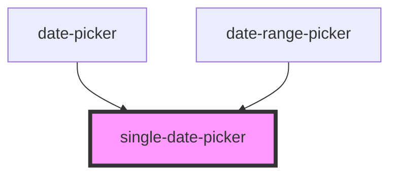

# single-date-picker

<!-- Auto Generated Below -->

## Properties

| Property                       | Attribute       | Description | Type                                                               | Default     |
| ------------------------------ | --------------- | ----------- | ------------------------------------------------------------------ | ----------- |
| `currentMonth` _(required)_    | `current-month` |             | `number`                                                           | `undefined` |
| `currentYear` _(required)_     | `current-year`  |             | `number`                                                           | `undefined` |
| `maxDate`                      | --              |             | `Date`                                                             | `undefined` |
| `minDate`                      | --              |             | `Date`                                                             | `undefined` |
| `picker_id` _(required)_       | `picker_id`     |             | `"datePicker1" \| "datePicker2"`                                   | `undefined` |
| `selected` _(required)_        | --              |             | `Date \| { startDate: Date; endDate: Date; }`                      | `undefined` |
| `setCurrentMonth` _(required)_ | --              |             | `(month: number, year: number, idComp: IdDatePickerState) => void` | `undefined` |
| `setCurrentYear` _(required)_  | --              |             | `(year: number, month: number, idComp: IdDatePickerState) => void` | `undefined` |
| `setMouseEnterDate`            | --              |             | `(v: Date) => void`                                                | `undefined` |
| `setSelected` _(required)_     | --              |             | `(v: Date) => void`                                                | `undefined` |

## Dependencies

### Used by

 - [date-picker](../../date-picker)
 - [date-range-picker](../../date-range-picker)

### Graph

----------------------------------------------

*Built with [StencilJS](https://stenciljs.com/)*
